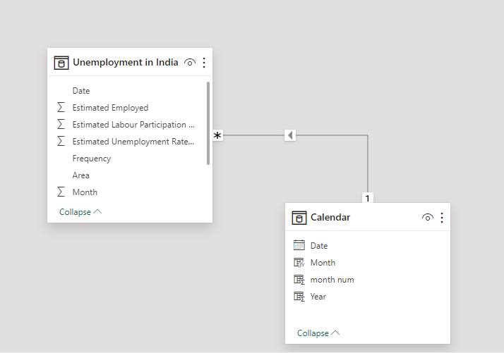
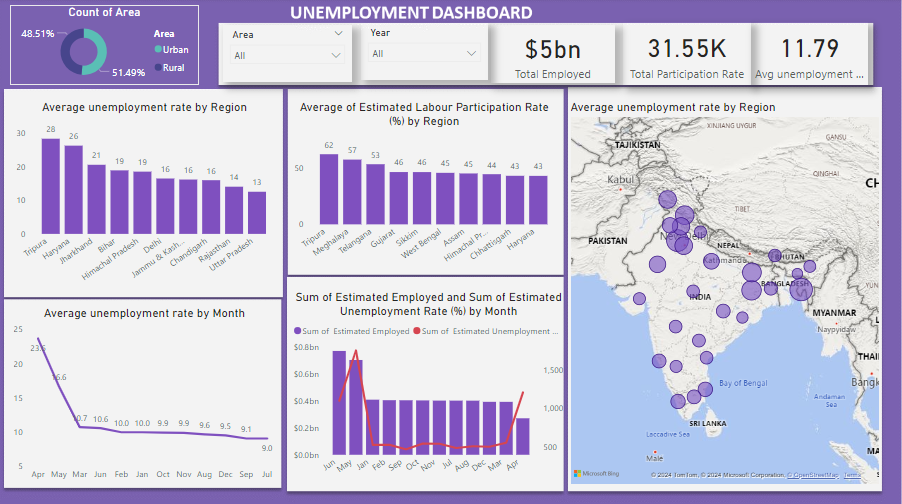

## UNEMPLOYMENT ANALYSIS

 

## Introduction: 
This Power BI project on Unemployment Analysis. The dataset contains the unemployment rate of all the states in India. The dataset includes information such as States, Date, Frequency, Estimated Unemployment Rate (%), Estimated Employed, and Estimated Labour Participation Rate (%).

## Content:
The dataset contains the following fields:
- States = states in India Date
- Date which the unemployment rate observed Frequency = measuring frequency (Monthly) 
- Estimated Unemployment Rate (%) = percentage of people unemployed in each States of India 
- Estimated Employed = Number of people employed 
- Estimated Labour Participation Rate (%) = The labour force participation rate is the portion of the working population in the 16-64 years' age group in the economy currently in 
  employment or seeking employment.
  
 ## Skills/ concepts demonstrated:
### The following Power BI features were incorporated.
- DAX, 
- Modelling
- slicers.

## Problem statement:
1.	What is the average unemployment rate by region?
2.	What is the average estimated labour participation rate by region?
3.	Which is the average unemployment rate by month?
4.	What is the sum of unemployed and sum of employment rate by month?

## Modelling:

There is only one table with a calendar table I created using Dax measures Calendar Auto().
The model is a star schema. The two tables are joined together with a one-to-many relationship. One table which is the fact table and the other table the date table.

## Visualization:
### This report comprises two page:

1.Main Dashboard
2.Insight

You can interact with the report [here](https://app.powerbi.com/view?r=eyJrIjoiODZhMmJmOTQtMTUzYS00Y2U5LTgxMmEtMTIwM2U4NWM4NmRkIiwidCI6ImNmNWM0NWEwLTcyOGItNDE1OC05NTY5LWQyZjNjYWI2NDJjNyJ9)

## Analysis:

### Main Dashboard

- At $766,717,078, Jun had the highest Sum of  Estimated Employed and was 184.55% higher than Apr, which had the lowest Sum of  Estimated Employed at $269,449,315.
- Sum of  Estimated Employed and total Sum of  Estimated Unemployment Rate (%) are positively correlated with each other.
- June accounted for 14.38% of Sum of  Estimated Employed.
- Across all 12 Month, Average unemployment rate ranged from 9.03 to 23.64.

### Insight and Recommendation

## Insight

- June recorded the highest sum of estimated employed individuals at 766,717,078, marking a substantial increase of 184.55% compared to April, which had the lowest sum of estimated employed at 269,449,315. This significant variation indicates seasonal fluctuations or changes in economic activity throughout the year.

- There is a positive correlation between the sum of estimated employed individuals and the total sum of estimated unemployment rate (%). This suggests that as the number of employed individuals increases, the unemployment rate tends to decrease, and vice versa. This correlation underscores the importance of monitoring both metrics to assess the overall health of the labor market.
- 
- June accounted for 14.38% of the sum of estimated employed individuals, indicating its significant contribution to the workforce during that period. Understanding the seasonal distribution of employment can help policymakers and businesses make informed decisions about resource allocation and workforce planning.

- The average unemployment rate across all 12 months ranged from 9.03% to 23.64%. This wide range highlights the variability in unemployment rates throughout the year and underscores the need for targeted interventions to address unemployment challenges across different periods.

## Recommendation
- Conduct further analysis to understand the factors driving the seasonal fluctuations in employment, particularly the sharp increase in June compared to April. This may involve examining factors such as seasonal hiring patterns, economic indicators, and industry trends.

- Implement policies and programs aimed at reducing unemployment rates, particularly during periods of higher unemployment. This could include job training initiatives, support for small businesses, and targeted job creation programs to stimulate economic growth and employment opportunities.

- Develop strategies to promote a more stable and resilient labor market, such as diversifying industries, investing in education and skills development, and fostering entrepreneurship. By reducing dependence on seasonal employment and creating more sustainable job opportunities, regions can mitigate the impact of economic fluctuations on employment rates.

- Monitor and track changes in unemployment rates over time to identify emerging trends and adjust policies accordingly. Regular assessment of labor market dynamics will enable stakeholders to respond effectively to evolving challenges and opportunities in the workforce.

